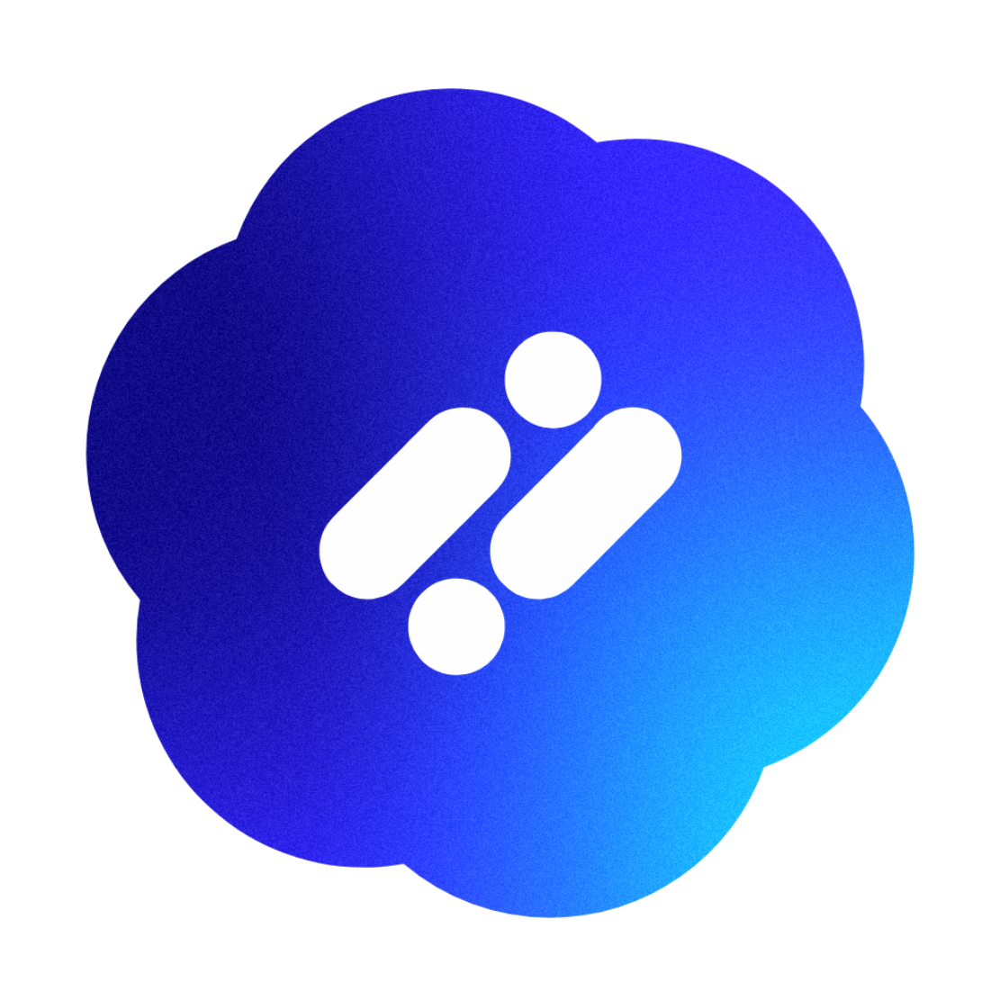

<link href="https://fonts.googleapis.com/css2?family=Varela+Round&display=swap" rel="stylesheet">

  <h1 style="font-family: 'Varela Round', sans-serif; font-weight: normal; margin-top: 15px; margin-bottom: 5px;">Vivek Gowda S</h1>
  
  

    B.Tech AIML Student &bull; Full-Stack Mobile Developer &bull; AI Product Builder
  

  

    Building production-ready, AI-driven mobile applications with React Native, Node.js, Firebase, and advanced LLM workflows.
  

  

    
    
    
    
  

---

<h2 style="font-family: 'Varela Round', sans-serif; font-weight: normal; font-size: 22px;">📱 Featured Project</h2>

<table width="100%" style="border-collapse: collapse; border: none; background: transparent; width: 100%;">
  <tr style="border: none; background: transparent;">
    <td align="center" valign="middle" width="150" style="padding: 10px; border: none; background: transparent;">
      
    </td>
    <td align="left" valign="middle" style="padding: 10px 10px 10px 20px; border: none; background: transparent;">
      <h3 style="font-size: 28px; margin: 0 0 10px 0; font-family: 'Varela Round', sans-serif; font-weight: normal; border-bottom: none;">
        <a href="https://switchaicloud.com" style="color: #0366d6; text-decoration: none;">SwitchAi</a>
      </h3>
      

        A multi-AI model routing platform that dynamically sends each query to the best-suited model, featuring real-time image bridging and seamless model switching for optimized intelligence and performance.
      

      

        🌐 **Website:** <a href="https://switchaicloud.com" style="color: #0366d6; text-decoration: none;">switchaicloud.com</a>
      

      

        
        &nbsp;&nbsp;
        
      

    </td>
  </tr>
</table>

---

<h2 style="font-family: 'Varela Round', sans-serif; font-weight: normal; font-size: 22px;">🚀 What I Build</h2>

<ul style="font-weight: normal; line-height: 1.6; color: #374151;">
  <li><strong>AI-Powered Mobile Apps:</strong> Seamlessly combining on-device performance with state-of-the-art LLMs.</li>
  <li><strong>Model Routing & Agents:</strong> Architecting workflows that route tasks to the most efficient model.</li>
  <li><strong>RAG Systems:</strong> Building retrieval pipelines to bring contextual domain knowledge to LLM workflows.</li>
  <li><strong>Production Experiences:</strong> Bringing ideas from initial concept all the way to App Store and Google Play releases.</li>
</ul>

---

<h2 style="font-family: 'Varela Round', sans-serif; font-weight: normal; font-size: 22px;">My Favorite Tools and Technologies</h2>

Tools and technologies that I work with most

<table style="font-family: 'Varela Round', sans-serif; font-weight: normal;">
  <tr>
    <td align="center" width="130" style="font-weight: normal;">
      
       React Native
    </td>
    <td align="center" width="130" style="font-weight: normal;">
      
       Node.js
    </td>
    <td align="center" width="130" style="font-weight: normal;">
      
       Firebase
    </td>
  </tr>
  <tr>
    <td align="center" width="130" style="font-weight: normal;">
      
       TypeScript
    </td>
    <td align="center" width="130" style="font-weight: normal;">
      
       Figma
    </td>
    <td align="center" width="130" style="font-weight: normal;">
      
       Git & GitHub
    </td>
  </tr>
</table>

---

<h2 style="font-family: 'Varela Round', sans-serif; font-weight: normal; font-size: 22px;">👤 About Me & Core Philosophy</h2>

  I am an AI/ML student and full-stack mobile developer dedicated to bridging the gap between advanced agentic workflows and beautiful, intuitive mobile user experiences. My development philosophy centers around:

<ul style="line-height: 1.6; color: #374151;">
  <li style="margin-bottom: 8px;"><strong>Product-First Development:</strong> I build apps that are not just technically advanced but production-ready—focusing on fluid performance, clean layout, and premium UX/UI.</li>
  <li style="margin-bottom: 8px;"><strong>Applied Intelligence:</strong> I specialize in integrating LLM architectures, intelligent model routing, and robust database layers into responsive mobile apps.</li>
  <li style="margin-bottom: 8px;"><strong>Full-Cycle Ownership:</strong> From the first conceptual design in Figma to API creation, database design, and final App Store/Play Store deployment, I enjoy owning the entire product lifecycle.</li>
</ul>

---

<h3 style="font-family: 'Varela Round', sans-serif; font-weight: normal; font-size: 18px;">Let's Connect!</h3>

<ul style="list-style-type: none; padding-left: 0; line-height: 1.8;">
  <li>🌐 <strong>GitHub:</strong> <a href="https://github.com/vivek-1910">vivek-1910</a></li>
  <li>💼 <strong>LinkedIn:</strong> <a href="https://www.linkedin.com/in/vivek-gowda-s-608002325/">Vivek Gowda S</a></li>
  <li>📧 <strong>Email:</strong> <a href="mailto:vivekgowdashivakumar@gmail.com">vivekgowdashivakumar@gmail.com</a></li>
</ul>

