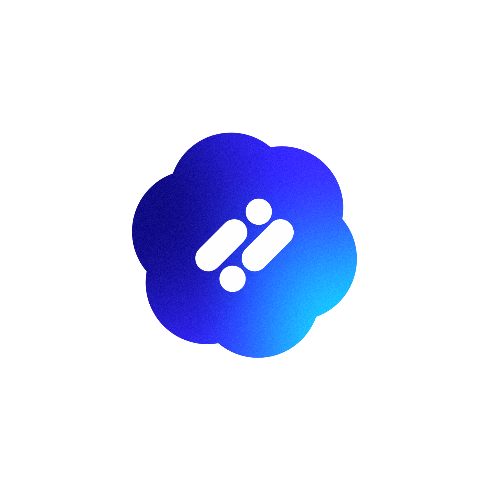

  

  # Vivek Gowda S

  

    <strong>B.Tech AIML student</strong> • <strong>Full-stack mobile developer</strong> • <strong>AI product builder</strong>
  

  

    Building AI-driven mobile apps with React Native, Node.js, Firebase, and LLM workflows.
  

  

    
    
    
    
  

## Featured Project

  <table>
    <tr>
      <td align="center" valign="middle" width="120">
        
      </td>
      <td align="left" valign="middle">
        <h3 style="margin:0 0 6px 0;">SwitchAi</h3>
        

          Multi-AI model routing platform that sends each query to the best-suited model, with support for image bridging and seamless model switching.
        

        <table>
          <tr>
            <td style="padding:0 12px 0 0;">
              
            </td>
            <td style="padding:0;">
              
            </td>
          </tr>
        </table>
      </td>
    </tr>
  </table>

## What I Build

- AI-powered mobile apps
- Model routing and agentic workflows
- RAG systems and LLM integrations
- Production-ready product experiences

## My Favorite Tools and Technologies

> Tools and technologies that I have worked with and am interested in

<table>
  <tr>
    <td align="center" width="130">
      
       React Native
    </td>
    <td align="center" width="110">
      
       Node.js
    </td>
    <td align="center" width="110">
      
       Express.js
    </td>
    <td align="center" width="110">
      
       Firebase
    </td>
    <td align="center" width="110">
      
       Expo
    </td>
  </tr>
  <tr>
    <td align="center" width="110">
      
       TypeScript
    </td>
    <td align="center" width="110">
      
       JavaScript
    </td>
    <td align="center" width="110">
      
       Python
    </td>
    <td align="center" width="110">
      
       C
    </td>
    <td align="center" width="110">
      
       Figma
    </td>
  </tr>
  <tr>
    <td align="center" width="110">
      
       REST APIs
    </td>
    <td align="center" width="110">
      
       Git
    </td>
    <td align="center" width="110">
      
       Linux
    </td>
    <td align="center" width="110">
      
       Git
    </td>
    <td align="center" width="110">
      
       Tailwind
    </td>
  </tr>
</table>

## Skills

- `LLMs`
- `RAG Pipelines`
- `Agentic Workflows`
- `Model Fine-tuning`
- `Auth`
- `RevenueCat`

## Core Stack

| Area | Tools |
| --- | --- |
| Mobile | React Native, Expo |
| Backend | Node.js, Express.js, REST APIs |
| AI | LLMs, RAG Pipelines, Agentic Workflows, Model Fine-tuning |
| Product | Firebase, Auth, RevenueCat, Git, Figma |

## Links

- [GitHub](https://github.com/vivek-1910)
- [LinkedIn](https://www.linkedin.com/in/vivek-gowda-s-608002325/)
- [Email](mailto:vivekgowdashivakumar@gmail.com)
- [Resume](https://github.com/vivek-1910/vivek-1910/blob/main/README.md)

## About Me

I like building apps from idea to release, especially where mobile UX and applied AI overlap.
