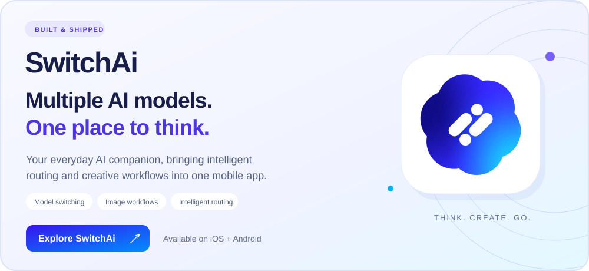

  

  <a href="https://switchaicloud.com">SwitchAi</a> &nbsp; / &nbsp;
  <a href="https://www.linkedin.com/in/vivek-gowda-s-608002325/">LinkedIn</a> &nbsp; / &nbsp;
  <a href="mailto:vivekgowdashivakumar@gmail.com">Email me</a> &nbsp; / &nbsp;
  <a href="https://play.google.com/store/apps/dev?id=7646915108714080194&amp;hl=en_IN">My apps</a>

 

### A little about me

I'm **Vivek**, an AI/ML student and full-stack mobile developer. I turn ideas into useful mobile products, connecting thoughtful interfaces with the AI systems behind them.

My favorite part? Owning the whole journey — from the first design to the API, the database, and the app people actually download.

 

## 01 / Built & shipped

  <a href="https://apps.apple.com/us/app/switchai-multi-ai-app/id6759476162"><strong>Download for iOS ↗</strong></a>
  &nbsp;&nbsp; · &nbsp;&nbsp;
  <a href="https://play.google.com/store/apps/details?id=com.vivekgowdas.SwitchAi&amp;hl=en_IN"><strong>Get it on Android ↗</strong></a>

 

## 02 / Where I spend my time

### ◇ &nbsp; Crafting the experience

Mobile apps should feel effortless. I work with **React Native and TypeScript** to turn an idea into a thoughtful interface, with the performance and polish to match.

### ⌘ &nbsp; Building the intelligence

Behind the interface: **LLM integrations, model routing, agents, and retrieval pipelines**. I like making complex systems feel simple to the person using them.

### ↗ &nbsp; Taking it all the way

From Figma to APIs, databases, and the final release — I enjoy connecting the pieces and **shipping to the App Store and Google Play**.

 

## 03 / On my workbench

  

**React Native** &nbsp; / &nbsp; **TypeScript** &nbsp; / &nbsp; **Node.js** &nbsp; / &nbsp; **Firebase** &nbsp; / &nbsp; **Figma** &nbsp; / &nbsp; **Git**

Mobile at the front. Applied AI behind it. Product thinking throughout.

 

---

### Have an idea in mind?

I'm always up for a conversation about mobile products, applied AI, or something useful we could build.

**[Let’s talk ↗](mailto:vivekgowdashivakumar@gmail.com)** &nbsp;&nbsp; [LinkedIn](https://www.linkedin.com/in/vivek-gowda-s-608002325/) · [GitHub](https://github.com/vivek-1910)
