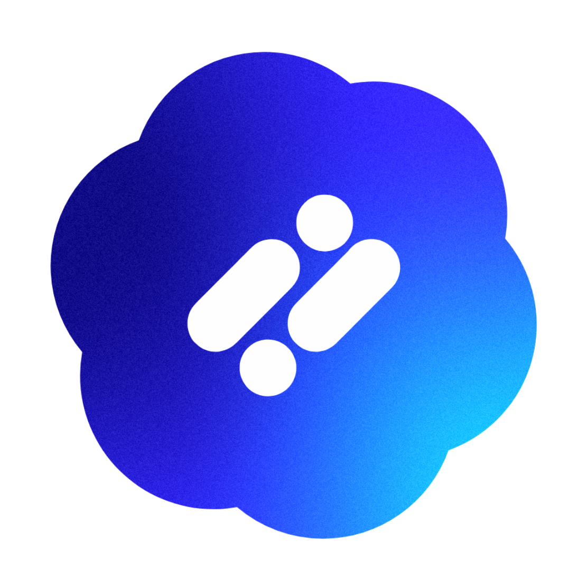

  

  <a href="https://switchaicloud.com">SwitchAi</a> &nbsp; / &nbsp;
  <a href="https://www.linkedin.com/in/vivek-gowda-s-608002325/">LinkedIn</a> &nbsp; / &nbsp;
  <a href="mailto:vivekgowdashivakumar@gmail.com">Email me</a> &nbsp; / &nbsp;
  <a href="https://play.google.com/store/apps/dev?id=7646915108714080194&amp;hl=en_IN">My apps</a>

 

### A little about me

I'm **Vivek**, an AI/ML student and full-stack mobile developer. I turn ideas into useful mobile products, connecting thoughtful interfaces with the AI systems behind them.

My favorite part? Owning the whole journey — from the first design to the API, the database, and the app people actually download.

 

## 01 / In the spotlight

### SwitchAi

**Multiple AI models. One place to think.**

An AI-powered mobile app built around intelligent model routing, image workflows, and seamless model switching. A project where mobile experience and applied AI come together.

  <a href="https://switchaicloud.com"><strong>Explore SwitchAi ↗</strong></a>
  &nbsp; · &nbsp; Available on iOS and Android

  
  &nbsp;
  

 

## 02 / What I work on

| Focus | What that looks like |
| :--- | :--- |
| **Mobile experiences** | React Native apps with thoughtful interfaces and fluid performance. |
| **Applied AI** | LLM integrations, model routing, and agent workflows that serve a real purpose. |
| **Context & retrieval** | RAG pipelines that bring relevant knowledge into the conversation. |
| **Shipping products** | Design, APIs, databases, and releases on the App Store and Google Play. |

 

## 03 / My everyday toolkit

**Build** &nbsp; React Native · TypeScript · Node.js 
**Connect** &nbsp; Firebase · LLM integrations · Retrieval pipelines 
**Design & ship** &nbsp; Figma · Git · GitHub · App Store · Google Play

 

---

### Good products start with a conversation.

Interested in mobile apps, applied AI, or building something useful? Let's connect.

**[Say hello ↗](mailto:vivekgowdashivakumar@gmail.com)** &nbsp;&nbsp; [LinkedIn](https://www.linkedin.com/in/vivek-gowda-s-608002325/) · [GitHub](https://github.com/vivek-1910)
