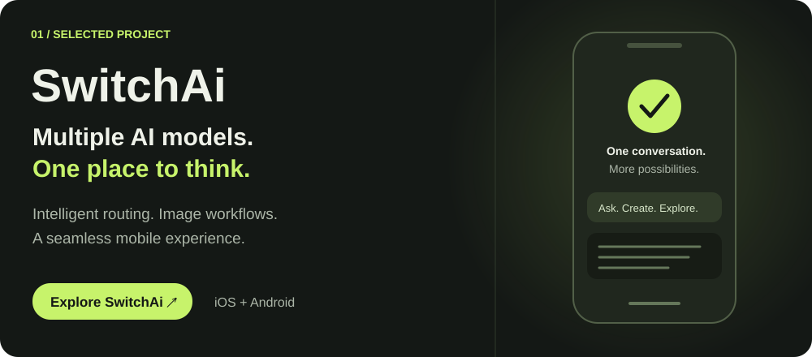
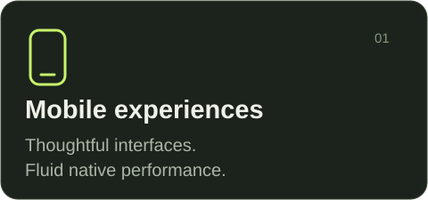
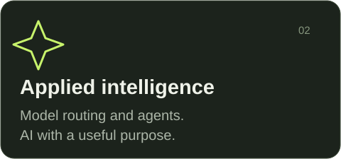
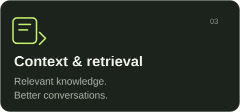
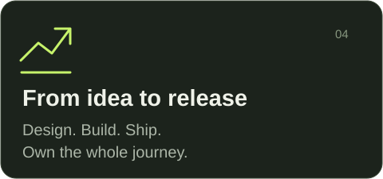
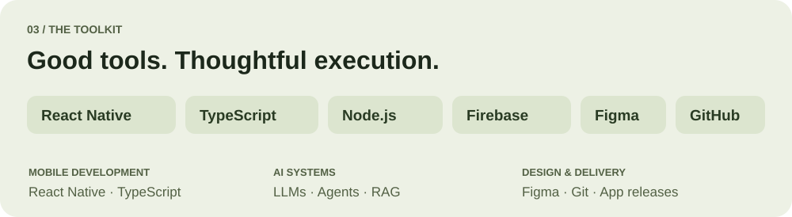
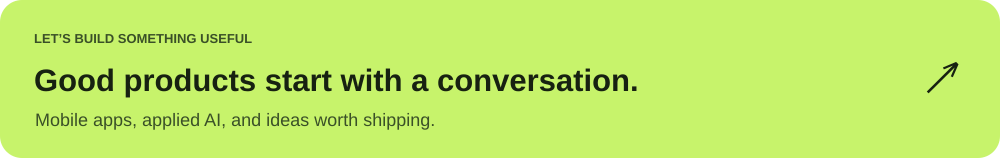

  

  <a href="https://switchaicloud.com">SwitchAi</a> &nbsp; / &nbsp;
  <a href="https://www.linkedin.com/in/vivek-gowda-s-608002325/">LinkedIn</a> &nbsp; / &nbsp;
  <a href="mailto:vivekgowdashivakumar@gmail.com">Email me</a> &nbsp; / &nbsp;
  <a href="https://play.google.com/store/apps/dev?id=7646915108714080194&amp;hl=en_IN">My apps</a>

 

### A little about me

I'm **Vivek**, an AI/ML student and full-stack mobile developer. I turn ideas into useful mobile products, connecting thoughtful interfaces with the AI systems behind them.

My favorite part? Owning the whole journey — from the first design to the API, the database, and the app people actually download.

 

  <a href="https://apps.apple.com/us/app/switchai-multi-ai-app/id6759476162"><strong>Download for iOS ↗</strong></a>
  &nbsp;&nbsp; / &nbsp;&nbsp;
  <a href="https://play.google.com/store/apps/details?id=com.vivekgowdas.SwitchAi&amp;hl=en_IN"><strong>Get it on Android ↗</strong></a>

 

## 02 / What I work on

  
  
  
  

 

 
 

  <a href="mailto:vivekgowdashivakumar@gmail.com">Email me ↗</a> &nbsp; / &nbsp;
  <a href="https://www.linkedin.com/in/vivek-gowda-s-608002325/">LinkedIn</a> &nbsp; / &nbsp;
  <a href="https://github.com/vivek-1910">GitHub</a>

